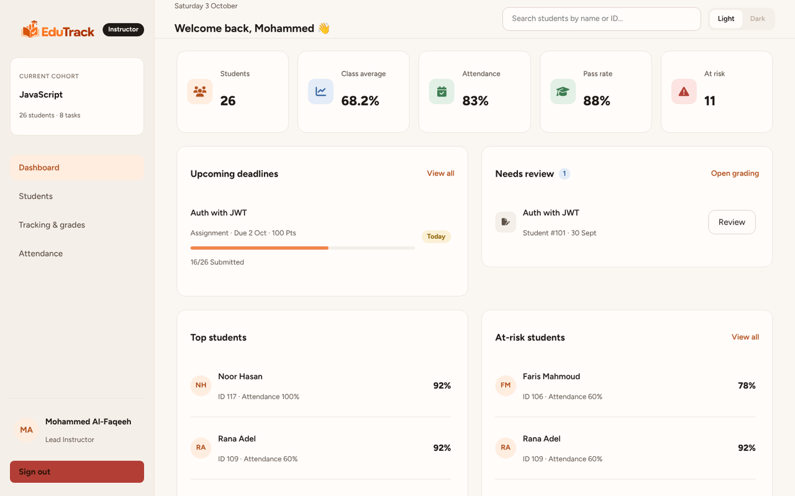
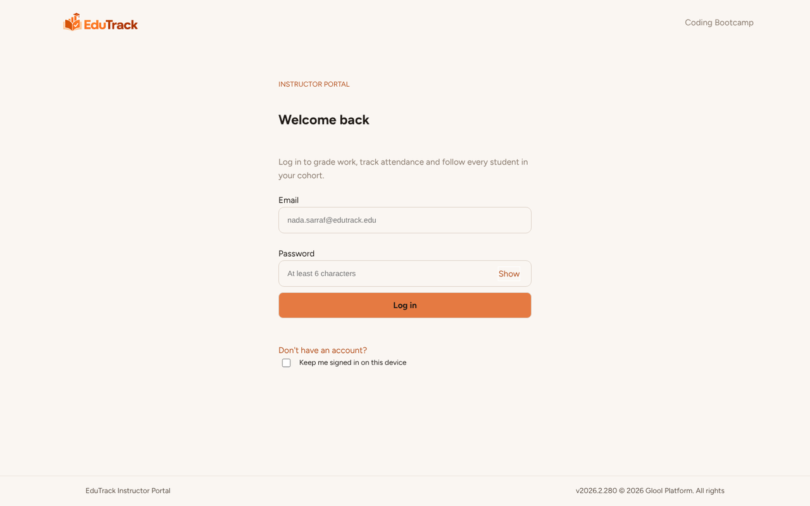
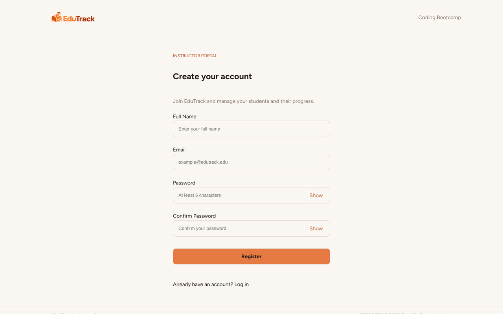
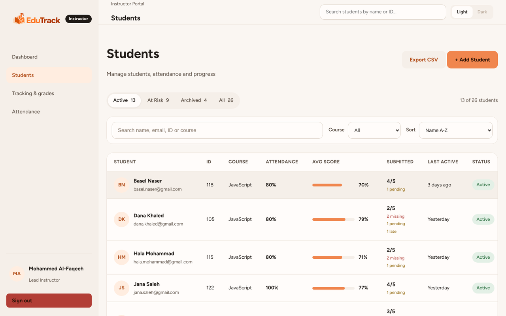
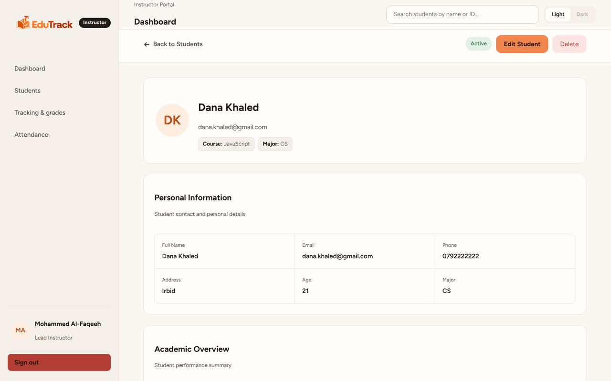
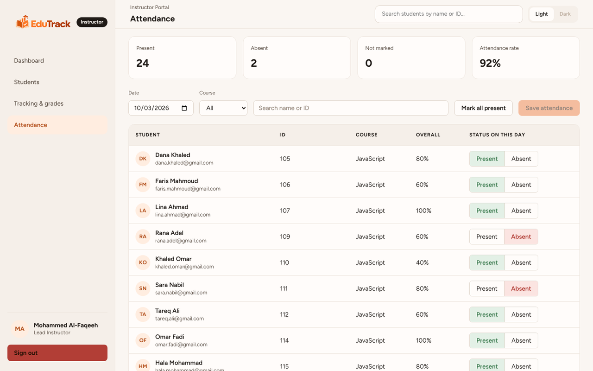
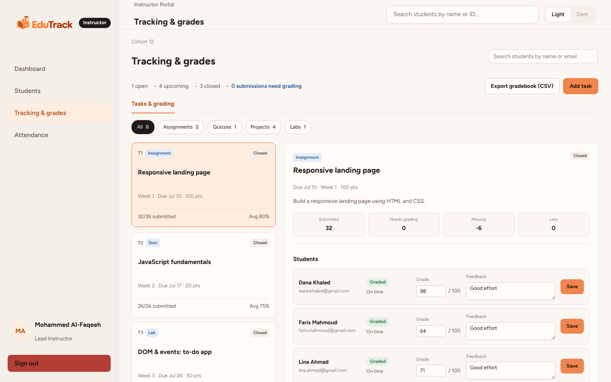
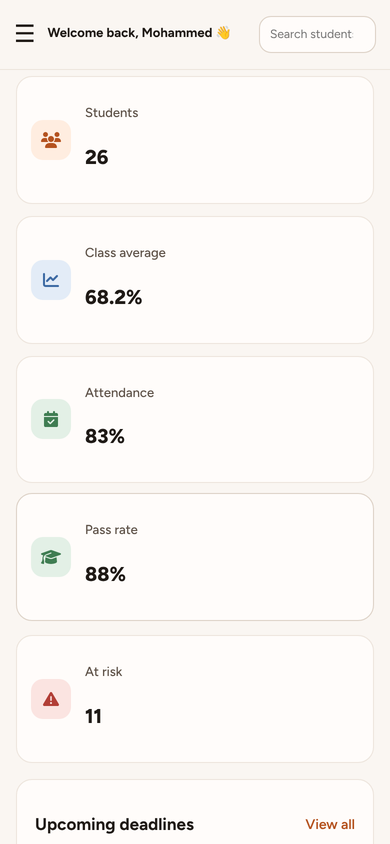
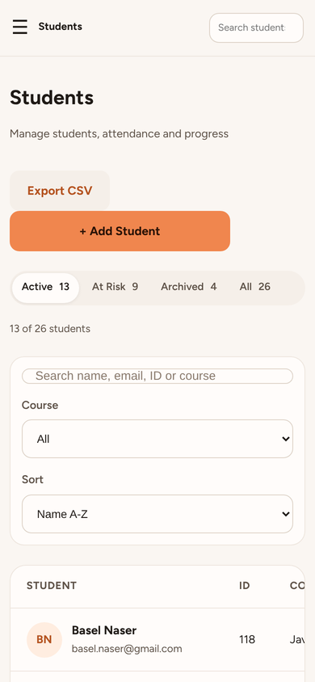
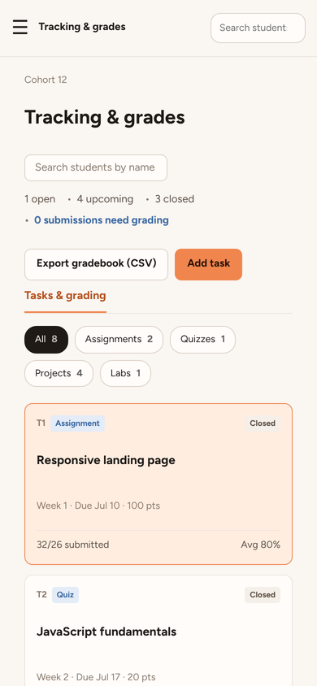

# EduTrack

**A Student Progress Tracking SaaS for instructors.**

EduTrack is an instructor portal where each instructor signs in, manages their own students, takes attendance, grades tasks and sees performance analytics. Every instructor sees only their own data.

Built as the JavaScript Capstone Project 1 at Orange Coding Academy.

📄 **Full screens documentation (PDF):** [docs/EduTrack-Screens.pdf](docs/EduTrack-Screens.pdf)

<p align="center">
  
</p>

## Features

- **Login & registration:** simulated multi-user login with form validation and "Keep me signed in".
- **Data isolation:** each instructor sees and edits only their own students, tasks and grades.
- **Dashboard:** class average, attendance, pass rate, at-risk students, deadlines, grade distribution chart and recent activity.
- **Students:** add, edit, delete and archive students, with search, filters, sorting and CSV export.
- **Student profile:** personal info, grades for every task, attendance record and feedback.
- **Attendance:** mark students present or absent for any date.
- **Tracking & grades:** add tasks, grade submissions with feedback and export the gradebook to CSV.
- **Extras:** responsive layout, light and dark theme, global student search.

## Screenshots

<table>
  <tr>
    <td align="center"><br><b>Login</b></td>
    <td align="center"><br><b>Registration</b></td>
  </tr>
  <tr>
    <td align="center"><br><b>Students</b></td>
    <td align="center"><br><b>Student Profile</b></td>
  </tr>
  <tr>
    <td align="center"><br><b>Attendance</b></td>
    <td align="center"><br><b>Tracking & Grades</b></td>
  </tr>
</table>

<p align="center">
  
  
  
  <br><b>Mobile view</b>
</p>

All pages in desktop and mobile view are in the [PDF documentation](docs/EduTrack-Screens.pdf).

## Tech Stack

HTML5 · CSS3 · Vanilla JavaScript (ES6+ modules, `fetch`, `async/await`) · json-server · localStorage / sessionStorage · Font Awesome · SweetAlert2

## Getting Started

1. Clone the project:

```bash
   git clone https://github.com/mustafajoudeh/Edu-Track.git
   cd Edu-Track
```

2. Start the mock API (requires [Node.js](https://nodejs.org/)):

```bash
   npx json-server db.json --port 3000
```

3. Open `index.html` with **Live Server** in VS Code.

4. Log in with the demo account: `mohammed@gmail.com` / `123456`

## API Notes

All data is stored in `db.json` and served by json-server at `http://localhost:3000`. Every request is filtered by the instructor's ID, for example:

| Method | Endpoint | Used for |
|---|---|---|
| GET | `/students?instructorId={id}` | Load the instructor's students |
| POST / PATCH / DELETE | `/students/{id}` | Add, edit or delete a student |
| GET / POST | `/tasks` | Load or add tasks |
| PATCH | `/submissions/{id}` | Save a grade and feedback |

> Passwords are stored as plain text and login is simulated in the browser. This is a learning project, not for real accounts.

## Team

| Name | Role |
|---|---|
| Mustafa | Scrum Master |
| Hind Bundoq | Product Owner |
| Mohammed AL-Faqih | Developer |
| Tamara Qweder | Developer |
| Dyaa Abuzanoneh | Developer |
